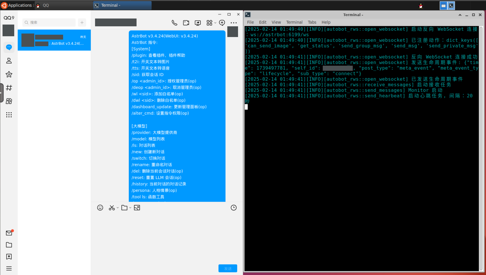

# AutoBot

使用 PyAutoGUI 的简单 QQ 消息平台，基于 OneBot11 协议。使用反向 WebSocket 连接。

支持的功能：

- [x] 发送私聊消息
   - 发送文本
   - 发送图片
   - 发送文件
- [x] 发送群聊消息
   - 发送文本
   - 发送 At
   - 发送图片
   - 发送文件
- [x] 接收私聊文本消息（只能收到前 128 个字）
- [x] 接收群聊消息
   - 接收 At
   - 接收文本消息（只能收到前 128 个字）

接收消息靠的是 QQ 发到系统通知栏的消息，所以只能收到前 128 个字，而且不能收到图片、文件等消息。虽然有点鸡肋，但是速度很快。

相比起 NapCat、这种完善的消息平台，AutoBot 的功能很少很少，但是它有一个巨大优势：

<p align='center'><b>“稳定，几乎不会被风控。”</b></p>

> AutoBot 的消息发送是通过 PyAutoGUI 模拟键鼠实现的，不容易检测。
>
> 除非是基于行为分析的风控系统，但这样容易误封，应该不会这么做。
>
>（要是这个也被风控了那估计除了 DMA 谁也没办法了 XD）

虽然只能发送文本、图片和文件，但是这已经能够满足很多娱乐性质的需求了，对于想纯粹娱乐娱乐群友而又担心小号暴毙的用户来说，AutoBot 是一个不错的选择。（并且不太可能用于恶意行为，效率太低）

推荐结合高层开发框架 [AstrBot](https://github.com/Soulter/AstrBot) 使用，本项目也是结合 AstrBot 开发的。接个 LLM 机器人完全没问题。

## 使用方法

### Docker 部署 AutoBot + Docker 部署 AstrBot

> [!WARNING]
>
> 需要 Linux 系统，且需要安装 Docker。
>
> 你的操作顺序应当完全按照下面的步骤，否则可能会出现问题。

创建一个网络，用于连接 AutoBot 和 AstrBot。

```bash
docker network create astr-network
```

然后按照 [AstrBot 的 Docker 部署教程](https://astrbot.soulter.top/deploy/astrbot/docker.html) 部署 AstrBot。

但要注意的是，AstrBot 需要加入到 `astr-network` 网络中（添加 `--network astr-network` 参数）。所以它的 `docker run` 命令应该类似于：

```bash
sudo docker run -itd \
    --network astr-network \    # 加入 astr-network 网络
    -p 6180-6200:6180-6200 \
    -p 11451:11451 \
    -v $PWD/data:/AstrBot/data \    # 映射数据文件夹, 请注意这里的 $PWD/data 路径, 后面 AutoBot 部署时会用到
    --name astrbot \
    soulter/astrbot:latest
```

请注意这里的 `$PWD/data` 路径，这是 AstrBot 的 data 文件夹，主要用于存放 AstrBot 的插件和配置。这是一个从宿主机到 AstrBot 容器的映射。

如果 AstrBot 插件要发送文件的话，它传递给 AutoBot 的文件路径是 AstrBot 的 Docker 容器里的路径。这个路径 AutoBot 是无法访问的，因为 AutoBot 和 AstrBot 在两个不同容器上。

而一般插件所发送的文件基本上都是存放在 AstrBot 的 data 文件夹，所以把这个文件夹从宿主机映射到 AutoBot ，以便 AutoBot 也能访问到这个路径下的文件。

```bash
git clone https://github.com/Qalxry/AutoBot
cd AutoBot
wget https://github.com/Qalxry/AutoBot/releases/latest/download/QQ_3.2.12_240927_amd64_01.deb -O ./bin/QQ_3.2.12_240927_amd64_01.deb
sudo docker build -t autobot .
sudo docker run -d \
    --name autobot \
    --network astr-network \
    -v {你的AstrBot的data文件夹的路径}:/AutoBot/AstrBot_data \
    -v $PWD/data:/AutoBot/data \
    -p 6901:6901 \
    -e VNC_PW=password \
    -u root \
    autobot
```

接下来配置你的 AutoBot ，复制 `config.default.yaml` 到 `data/config.yaml` ，然后修改它。

参考配置如下：

```yaml
# WebSocket 服务器地址，基于 OneBot11 协议的 aiocqhttp 反向 WebSocket 。
# 如果 AutoBot 和 AstrBot 运行在不同的 Docker 容器中，但是在同一个 docker 网络下，
# 那么你可以使用容器名称来连接 WebSocket 服务器。
# 需要将主机更改为 AstrBot 的容器名称，例如 ws://astrbot:6199/ws
ws_server: ws://astrbot:6199/ws

# 重新连接到 WebSocket 服务器之前的延迟时间
reconnect_delay: 5

# 发送 ping 消息到 WebSocket 服务器的间隔
ping_interval: 20

# ping 消息的超时时间
ping_timeout: 20

# AutoBot 日志级别 (DEBUG, INFO, WARNING, ERROR, CRITICAL)
log_level: INFO

# 机器人的 QQ 号码
self_id: '1950154414'

# 机器人的 QQ 昵称
self_name: Vanilla

# 机器人的联系人信息，相当于手动设置机器人的好友列表和群列表，群成员也可以写到 private 里
# 这个不是必须的，但是如果想使用 At 功能，就需要设置这个
chat_info:
    '987654321':
        chat_name: QQ群群名
        chat_type: group
    '233333333':
        chat_name: QQ用户名
        chat_type: private

# PyAutoGUI 的等待时间，单位为秒
# 这个可能需要根据你的系统性能调整，如果你的系统性能较差，可以适当增加这个值
# 但是不要设置得太大，否则会导致机器人响应变慢、消息被忽略等问题
WAIT_TIME: 0.5
SMALL_WAIT_TIME: 0.05

# 定位 QQ 窗口和输入框的方法
# 这两个都是对于整个屏幕的，absolute 是固定值，而 relative 是屏幕宽度或高度的比例
# LOCATE_METHOD: absolute
# QQ_WINDOW_POS: [640, 800]
# QQ_INPUT_POS: [862, 1455]
# OTHER_WINDOW_POS: [1960, 800]
LOCATE_METHOD: relative # relative 或 absolute
QQ_WINDOW_POS: [0.25, 0.5] # 0.25 表示屏幕宽度的 25%
QQ_INPUT_POS: [0.25, 0.9]
OTHER_WINDOW_POS: [0.75, 0.5]

# 临时目录
TEMP_DIR: temp

# AstrBot/data 的目录，用于获取 AstrBot 想要发送的文件。
# 当你以 Docker 形式运行时，这非常重要。
# AutoBot 会将 AstrBot 发送的文件路径中的 /AstrBot/data 前缀替换为此路径前缀。
ASTRBOT_DATA_DIR: /AutoBot/AstrBot_data

# 启动时清理临时目录，以避免临时文件的积累。
clear_temp_at_startup: False

# 通知重复次数，有的系统上会重复截获通知，你可以设置这个值来避免重复处理
# 1 表示没有重复，2 表示每个通知会被捕获两次，以此类推。
NOTIFICATION_REPEAT_COUNT: 1
```

配置好之后，打开 `https://{宿主机的域名}:6901` （本地就是 `https://127.0.0.1:6901` ），注意是 HTTPS 。

输入用户名 `kasm_user` 和密码 `password` 登录 WASM VNC，进入桌面。

在桌面右键，打开 `Terminal` ，输入：

```bash
nohup /opt/QQ/qq --no-sandbox >/dev/null 2>&1 &
```

这会打开 QQ 客户端，你需要登录你的 QQ 账号，并关掉一些更新弹窗之类的。

然后：

***请务必将 QQ 的窗口拖动，让它完全占据屏幕的左半边，然后将 `Terminal` 窗口拖动，让它完全占据屏幕的右半边。这样 AutoBot 才能正常工作！！！！***

然后在 `Terminal` 中输入：

```bash
cd /AutoBot
python3 main.py
```

这样 AutoBot 就启动了。

接下来，***请务必保证窗口焦点在 `Terminal` 上！！！具体做法就是点一下 `Terminal` 窗体让它保持在最前端，这样 AutoBot 才能够正常收到消息！！！***



然后就不需要动了，关闭浏览器页面即可。输入 `/help` 测试你的机器人是否正常工作。如果你的 AstrBot 和 AutoBot 都正常工作，应当可以很快收到回复。

### 其他部署方式

请参考 Dockerfile 中的内容，自行部署。

## 许可

本项目基于 GPL-3.0 协议。
